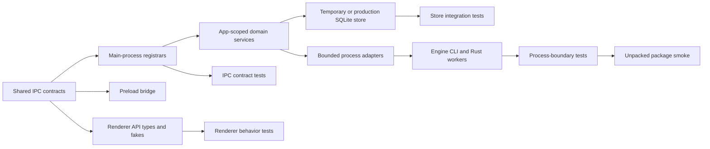
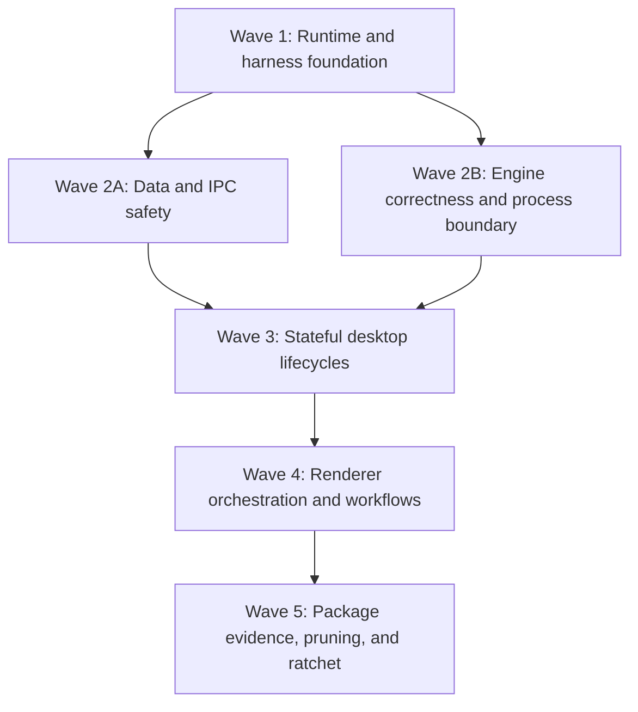

# DevDesk Test Suite Modernization — Technical Plan

> Companion to [DevDesk Test Suite Modernization.md](./DevDesk%20Test%20Suite%20Modernization.md). **Living ledger:** [test-review-ledger.md](./test-review-ledger.md).

## Architectural approach

Modernize the suite through a shared foundation followed by risk-ordered vertical waves. Tests should exercise the narrowest real boundary that proves a product invariant: pure logic at unit level, renderer behavior through a typed preload fake, persistence through temporary SQLite databases, process behavior through real child boundaries, and packaged behavior through the actual unpacked application.

Production refactoring is permitted only where critical behavior cannot be isolated reliably. The preferred pattern is targeted seam extraction with regression tests before and after the change, not broad rewrites of `App.tsx` or `registerIpc.ts`.

## Governing decisions

| Decision            | Direction                                                                             | Rationale                                                                              |
| ------------------- | ------------------------------------------------------------------------------------- | -------------------------------------------------------------------------------------- |
| Runtime support     | Support Node 22 and 24; Node 22 is the documented/default packaging lane              | Covers the current local environment while keeping a lower-risk canonical build lane   |
| Native dependencies | Use one `better-sqlite3` v12 contract across root, engine tests, and packaging        | Tests and production must not resolve different native majors                          |
| Testability         | Extract targeted seams only                                                           | Enables deterministic tests without turning the initiative into an application rewrite |
| IPC authority       | Add a lightweight shared workspace package for channel names and TypeScript contracts | Removes drift among main, preload, renderer declarations, and test fixtures            |
| Coverage            | Measure first, then enforce and ratchet per suite and critical module                 | Avoids invented targets and global-number gaming                                       |
| CI compatibility    | Require Node 22 and 24 native/integration lanes on Windows and Linux                  | Makes the declared dual-runtime support real                                           |
| Packaged validation | Package and verify once per OS under Node 22                                          | Electron ABI validation does not need duplicate host-Node package jobs                 |
| Delivery            | Foundation first, then risk-ordered waves                                             | Prevents parallel suites from inventing incompatible fixtures and boundaries           |

## Runtime and dependency contract

- Add a root Node engine range covering Node 22.12 through Node 24, with Node 22 recorded as the default development and packaging line.
- Select and record the exact default Node 22 patch when the runtime ticket begins. CI compatibility lanes track the supported Node 22 and 24 lines.
- Align root and engine manifests on the same `better-sqlite3` v12 range and lockfile resolution. Engine Vitest, desktop tests, smoke scripts, and packaged resources must exercise that same major.
- Node-native tests rebuild for the active host ABI in every compatibility lane. Packaging rebuilds separately for the Electron target ABI.
- A native check passes only after functional use: open and query an in-memory SQLite database; create, interact with, resize, and close a PTY where the platform supports it. Presence checks and accepted ABI failures are labeled as layout checks, not compatibility evidence.
- Rust tests run with `cargo test --locked` as an enforced gate. Rust coverage is not initially required; semantic assertions replace success-only tests first.

## Test boundaries and reusable seams

### Shared IPC contract

Create a neutral workspace package containing only channel constants and TypeScript request, response, and event contracts. It must not import Electron, renderer code, persistence, or other runtime services.

Main-process registration, preload invocation/subscription mapping, renderer global types, and test fakes consume this authority. An exhaustive contract suite fails on missing or extra channels, mismatched argument order, duplicate registration, or an event subscription that does not remove its exact listener.

Types do not replace runtime validation. Privileged handlers use a common registration wrapper that:

1. validates the sender against the active DevDesk window and allowed development or packaged origin;
2. invokes domain-specific runtime guards for untrusted payloads;
3. normalizes expected errors without hiding diagnostics;
4. registers and disposes handlers deterministically.

External navigation and `shell.openExternal` accept an explicit safe scheme allowlist. Filesystem, project, and attachment inputs are confined at the service boundary rather than trusted because they came through typed preload code.

### App-scoped lifecycle services

Move mutable maps and long-lived subscriptions behind focused app-scoped services only when their tests require it. Candidate owners include commands and chains, trigger confirmations, terminals, Docker log subscriptions, file indexes, and engine child processes.

Each service exposes explicit lifecycle operations and an idempotent `dispose()` used by tests and application shutdown. Exactly-once finalization, listener ownership, bounded output, stop/exit races, and cleanup are service invariants.

### Persistence seam

Add a store factory that accepts a database handle or path. Production retains its singleton facade, while tests create isolated temporary SQLite databases and exercise real transactions, foreign keys, migrations, cascades, and concurrency.

Mocked store tests remain appropriate for orchestration failures, but they do not count as evidence for atomicity, constraints, or destructive behavior.

### Process seam

Use a small injected process adapter for engine commands and Rust workers. It owns timeout, cancellation, kill escalation, stdout/stderr collection, output limits, exit interpretation, and protocol parsing.

Process-boundary tests run the built CLI or worker where the contract itself is under test. Spawn errors, timeouts, non-zero exits, malformed or trailing protocol output, split chunks, and missing binaries reject with diagnostics; they must never become empty-success results.

### Renderer harness

Provide one typed `electronAPI` builder per test with sensible rejected-by-default methods, subscription callback capture, and automatic teardown. Add reusable fakes for timers, clipboard, URL/blob downloads, observers, match media, and xterm.

Renderer Vitest discovers both `.test.ts` and `.test.tsx`. Tests assert user-observable state, exact IPC payloads, ownership filtering, race suppression, and cleanup—not mocked child labels or redundant truthiness after throwing queries.

## Critical product invariants

The following defects are inside the initiative because they affect security, data loss, correctness, or indefinite process lifecycle. Each fix begins with a regression test that fails for the intended reason.

| Domain                      | Required invariant                                                                                                                             |
| --------------------------- | ---------------------------------------------------------------------------------------------------------------------------------------------- |
| Import and replace          | Validate rows before mutation; any row failure rolls back the entire replace; backups and foreign-key integrity are explicit outcomes          |
| Attachments and files       | Absolute paths, traversal, junctions, symlinks, imported stored paths, and time-of-check/time-of-use changes cannot escape the allowed root    |
| Privileged IPC              | Only the trusted DevDesk window invokes privileged handlers; malformed values and unsafe external schemes are rejected                         |
| Engine indexing             | Identity is based on canonical path plus content state; rename, deletion, and duplicate-content files cannot disappear incorrectly             |
| Regex search                | Regex correctness does not depend on treating arbitrary regex text as an FTS literal; invalid patterns and limits fail predictably             |
| Worker and engine processes | Timeout, cancellation, malformed protocol, stderr, non-zero exit, and spawn failure are loud and bounded                                       |
| Stateful lifecycles         | Commands, chains, triggers, terminals, and log streams finalize once, bound output, filter by owner/id, and clean up on stop, unmount, or quit |

Discoveries outside these classes are recorded for later work. If a discovery materially changes product behavior, architecture, or initiative scope, implementation stops for realignment rather than silently expanding the project.

## Coverage and traceability

Use V8 coverage for TypeScript suites. Coverage includes production `.ts` and `.tsx` files and intentionally excludes declarations, generated output, fixtures, and low-level UI primitives whose behavior is already covered through consumers.

Coverage enforcement follows this lifecycle:

1. collect and publish an unblocked baseline after the foundation is operational;
2. add risk-wave tests and critical fixes;
3. record achieved per-suite and critical-module line, function, and branch coverage;
4. activate thresholds at the measured corrected baseline;
5. only raise thresholds as coverage improves—lowering one requires an explicit planning decision.

Percentages are secondary to invariant coverage. Every destructive, privileged, process-boundary, and subscription-heavy workflow maintains an explicit contract matrix covering success, validation or cancellation, backend failure, race behavior, and cleanup where applicable.

Maintain a review ledger during execution with:

- every pre-existing test file and its disposition: retain, strengthen, consolidate, replace, or remove;
- every meaningful production surface, its risk tier, and its direct or higher-level coverage owner;
- every critical defect, its failing regression, correction, and verification command.

This ledger is the evidence that “all tests reviewed” was completed; raw test count is not.

## CI and release topology

| Lane                   | Matrix                          | Responsibilities                                                                                                           |
| ---------------------- | ------------------------------- | -------------------------------------------------------------------------------------------------------------------------- |
| Static and coverage    | Ubuntu, Node 22                 | Typecheck, lint, architecture lint, renderer/desktop/engine coverage reporting                                             |
| Native and integration | Windows + Ubuntu × Node 22 + 24 | Clean install, Node-native rebuild, desktop and engine tests, real SQLite/PTTY checks, engine process and IPC integrations |
| Rust                   | Windows + Ubuntu, once per OS   | `cargo test --locked` and Rust build                                                                                       |
| Package verification   | Windows + Ubuntu, Node 22       | Electron rebuild/package, actual unpacked-layout verification, functional Electron-native smoke, packaged engine flow      |
| Release sign-off       | Windows + Linux packaged apps   | Separate interactive QA tracked in `docs/manual-qa.md`                                                                     |

Every spawned process in tests and gates has an explicit timeout and teardown path. CI logs label unit, integration, process, synthetic-layout smoke, actual-package smoke, and manual evidence distinctly.

## Implementation sequence

### Wave 1 — Runtime and harness foundation

- Align Node and native dependency contracts.
- Add the four compatibility lanes and Rust gate.
- Introduce the shared IPC contract without changing behavior.
- Broaden renderer discovery, add typed renderer fixtures, temporary-store factory, process adapter, and coverage collection.
- Create the initial test/surface review ledger.

### Wave 2A — Data and IPC safety

- Add exhaustive IPC registration, preload mapping, sender, validation, and external-navigation contracts.
- Cover import/export replace and merge semantics with real SQLite transactions.
- Fix and test attachment and filesystem confinement, bug attachment compensation, store constraints, cascades, and destructive rollback.
- Cover LLM context privacy and deterministic bounding.

### Wave 2B — Engine correctness and process boundary

- Add real main-to-engine child-process tests and bounded failure handling.
- Add full-to-incremental indexing regressions and correct path/hash identity.
- Add regex semantics, worker protocol, corrupt-output, cancellation, and timeout coverage.
- Strengthen Rust tests to assert semantic output rather than success alone.

Waves 2A and 2B may proceed in parallel after Wave 1 because their production ownership is separate.

### Wave 3 — Stateful desktop lifecycles

- Cover commands, chains, triggers, history finalization, terminal ownership, Docker streams, Git failure paths, file indexing/editing, tray/window/bootstrap, and shutdown cleanup.
- Extract app-scoped lifecycle services only where necessary to prove the invariants.
- Consolidate or remove weak desktop tests as each domain gains stronger replacements.

### Wave 4 — Renderer orchestration and workflows

- Cover partial bootstrap, event synchronization, deduplication, listener cleanup, command/history flows, terminal behavior, and executable Markdown fences.
- Add direct behavior coverage for automation, projects, containers, import/export, bugs, Git, engine, notes, health, and command palette surfaces according to risk.
- Consolidate repetitive tab/copy tests and remove unreachable placeholders or stale renderer-only references where verified safe.

### Wave 5 — Package evidence, pruning, and ratchet

- Add functional packaged SQLite, PTY, and engine smoke on Windows and Linux.
- Finalize the disposition ledger and remove generated test artifacts from production emit.
- Activate measured coverage thresholds and document the ratchet policy.
- Run the full corrected-head CI topology and update release/test documentation without claiming automated evidence is interactive QA.

## Verification rule for every wave

Each wave must leave its affected suites green under the Node 22 default, add the relevant Node 24/platform evidence, and preserve all previously completed invariants. Critical fixes require a demonstrated failing regression before the fix and a passing targeted plus cumulative gate afterward. Native rebuild artifacts are treated as generated state and never used as proof without a clean-install or clean-rebuild path.